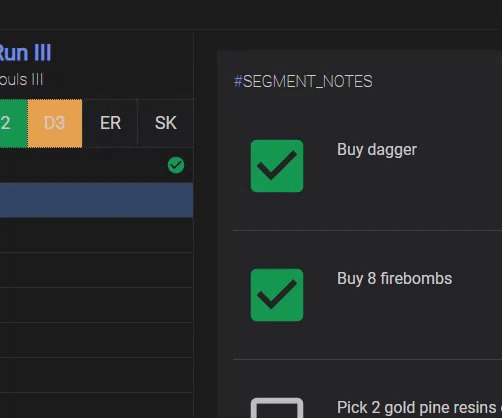
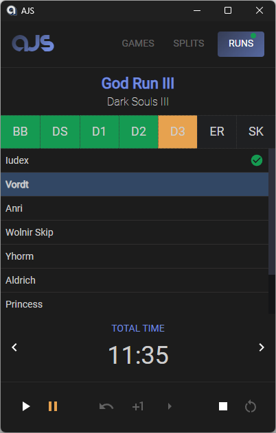

# Ain't Just Splits (AJS)
AJS is an assistance tool for hardcore gamers who do speedruns, no-hit/no-death runs.

## Key features
* Support of multi-split runs (incl. total run time, total hits etc.).
* Queued splits can be easily reordered during the ongoing run.
    

      
Show example

       
    

* [Markdown](https://www.markdownguide.org/cheat-sheet/)-enriched TODOs/notes for your segments, so you never forget to do important things during the run. You can put formatted text, links, images, tables and many more.
* UI was designed with streamers in mind: the left part of app may be streamed to your viewers as it contains the most important statistics, while the right one should help you to successfully complete runs. You may freely change the ratio between the two or hide the right part if you don't need it.
    

      
Show examples

       
       
    

## Future plans
* PB support
* History and statistics
* Import and export (incl. `.lss` file import)
* Various customization options
* UI improvements + new themes
* Hot-keys support
* Integration with third-party services
* Multi-platform support: macOS, Linux, Android
* i18n

### Stay tuned!
